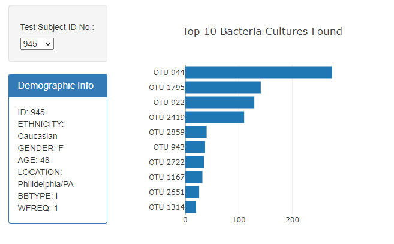
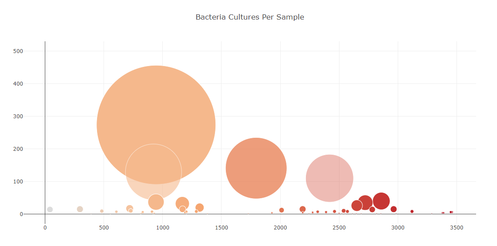

# Plot.ly Homework - Belly Button Biodiversity

I built an interactive dasbhoard to examine the Belly Button Biodiversity dataset, which cataologs the microbes that colonize human levels.  The dasbhoard analyzes microbial species, referred to as OTUs (operational taxonomic units), found in
more than 70% of people.

I used the D3 library to read in 'samples.json.' Each sampled selected populated the following information:

 - Demographic information of each subject
 
 - A horizontal bar chart displaying the top 10 OTUs found in that individual.
 
 
 
 - A bubble chart displaying each sample
 
 
 
Any time a new sample is selected the information in each section changes to reflect that sample.

